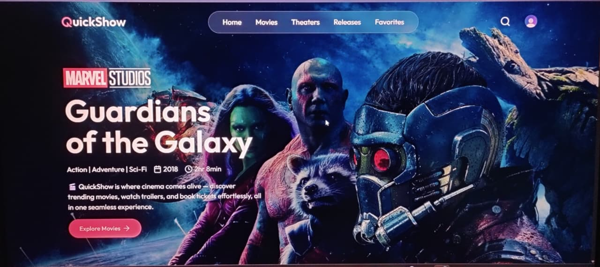
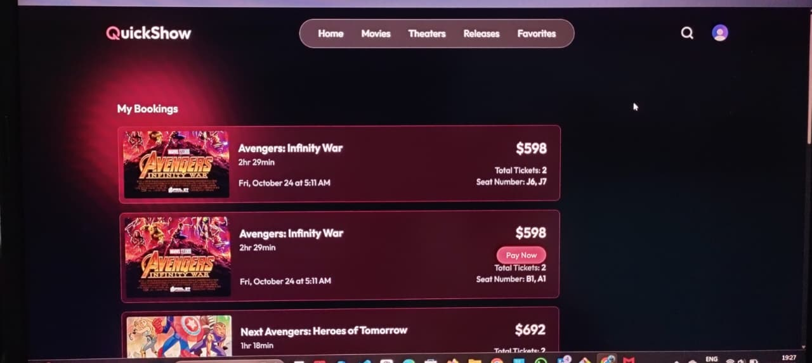
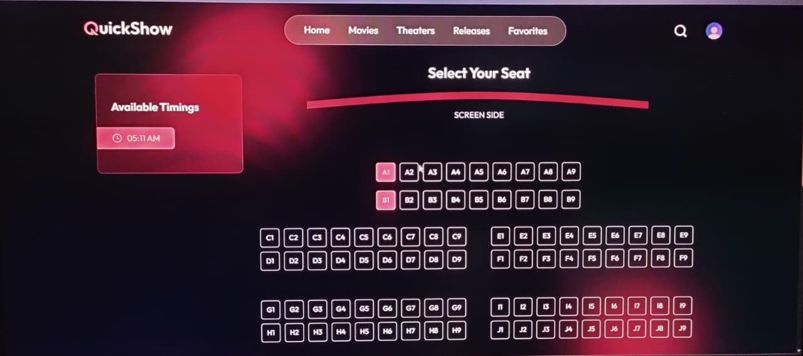
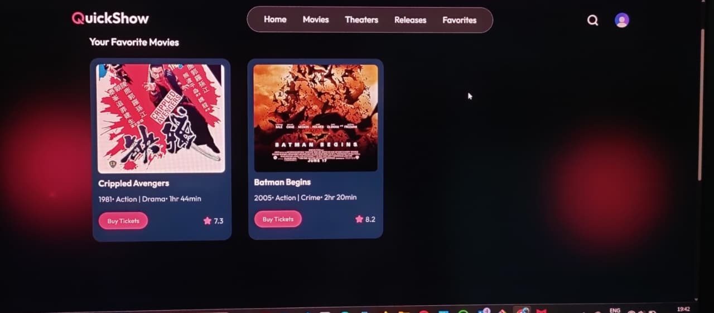
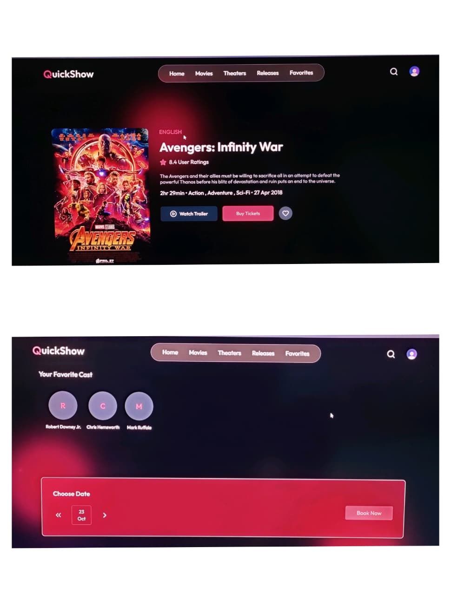
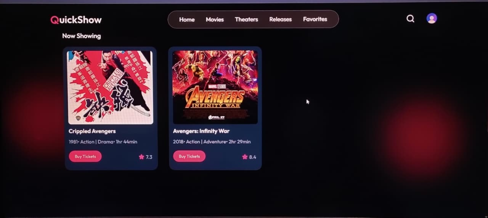
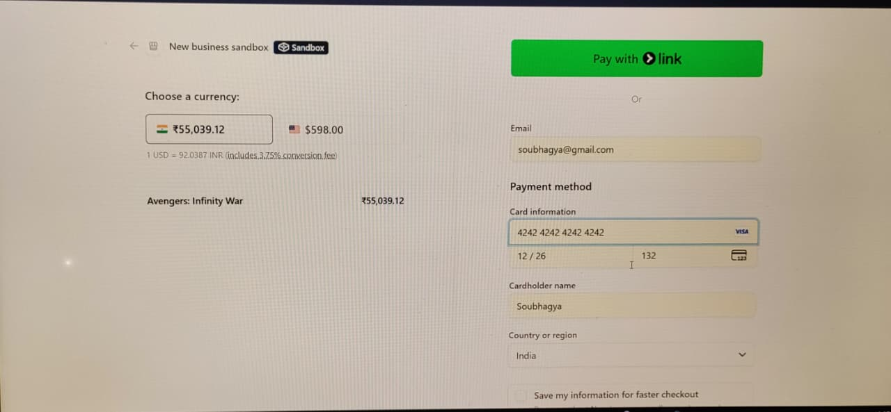

# 🚀 MERN Quick Show App (Movie Ticket Booking)

A full-stack web application built with the MERN stack (MongoDB, Express.js, React.js, Node.js) that provides a platform for showcasing and discovering various content quickly and efficiently.

## ✨ Features

### 🔐 Authentication & User Management
- **User Registration & Login** with secure authentication
- **JWT-based** session management
- **Protected routes** and authorization
- **User profile management**

### 🎯 Core Functionality
- **Quick Content Showcase** - Display your items in an attractive layout
- **Search & Filter** - Find content quickly with advanced filtering
- **Responsive Design** - Optimized for all devices
- **Real-time Updates** - Dynamic content loading
- **Interactive UI** - Smooth user experience with modern design

### 📱 User Interface
- **Modern Dashboard** with intuitive navigation
- **Card-based Layout** for content presentation
- **Clean & Minimalist** design approach
- **Fast Loading** with optimized performance

## 🛠️ Technology Stack

### Frontend
- **React.js** - UI framework
- **React Router** - Navigation
- **Axios** - HTTP client
- **CSS3** - Styling and animations
- **Context API** - State management

### Backend
- **Node.js** - Runtime environment
- **Express.js** - Web framework
- **MongoDB** - Database
- **Mongoose** - ODM
- **JWT** - Authentication
- **bcrypt** - Password hashing

### Development Tools
- **Nodemon** - Development server
- **Concurrently** - Run multiple commands
- **CORS** - Cross-origin requests

## 🌐 Live Preview

https://quickshow-rust-ten.vercel.app/


## 📸 Screenshots

### 🏠 Dashboard Page


### 🎫 Booked Tickets Lists


### 💺 Seat's Availability


### ❤️ Favorite Lists


### 🎬 Booking Movies


### 📽️ Movie Lists Page


### 💳 Stripe Payment



## 🚀 Quick Start

### Prerequisites
- Node.js (v14 or higher)
- MongoDB (local or Atlas)
- npm or yarn

### Installation

1. Clone the repository
   
   ```bash
   git clone https://github.com/JaspalBarik/MERN-QUICKSHOW.git
   cd MERN-QUICKSHOW
   
2. Install dependencies
   
    # Install server dependencies
    npm install

# Install client dependencies
cd client
npm install
cd ..

3. Environment Setup

Create .env file in the root directory
Add the following variables:

PORT=5000
MONGODB_URI=your_mongodb_connection_string
JWT_SECRET=your_jwt_secret_key
NODE_ENV=development

4. Run the application

   # Development mode (runs both client and server)
npm run dev

# Or run separately:

# Start backend server
npm run server

# Start frontend client (in new terminal)
npm run client

5. Access the application

Frontend: http://localhost:3000

Backend API: http://localhost:5000

📁 Project Structure

MERN-QUICKSHOW/
├── client/                 # React frontend
│   ├── public/
│   ├── src/
│   │   ├── components/
│   │   ├── pages/
│   │   ├── context/
│   │   ├── utils/
│   │   └── App.js
│   └── package.json
├── server/                 # Express backend
│   ├── controllers/
│   ├── models/
│   ├── routes/
│   ├── middleware/
│   ├── config/
│   └── server.js
├── screenshots/           # Application screenshots
├── .env
└── package.json

🔧 Available Scripts
Root Directory
npm run dev - Run client and server concurrently

npm run server - Run backend server only

npm run client - Run frontend client only

npm run build - Build client for production

Client Directory
npm start - Start development server

npm run build - Build for production

npm test - Run tests

🌐 API Endpoints
Authentication
POST /api/auth/register - User registration

POST /api/auth/login - User login

GET /api/auth/me - Get current user

Content Management
GET /api/content - Get all content

POST /api/content - Create new content

GET /api/content/:id - Get single content

PUT /api/content/:id - Update content

DELETE /api/content/:id - Delete content

🎨 Customization
Adding New Features
Create new model in server/models/

Add routes in server/routes/

Create controller in server/controllers/

Add React components in client/src/components/

Update navigation and state management

Styling
Modify CSS files in client/src/

Update color scheme in CSS variables

Add new components with consistent design

🤝 Contributing
We welcome contributions! Please feel free to submit pull requests or open issues for bugs and feature requests.

Contribution Guidelines
Fork the repository

Create a feature branch (git checkout -b feature/AmazingFeature)

Commit your changes (git commit -m 'Add some AmazingFeature')

Push to the branch (git push origin feature/AmazingFeature)

Open a Pull Request

📄 License
This project is licensed under the MIT License - see the LICENSE file for details.

👥 Authors
Jaspal Barik - Initial work - JaspalBarik

🙏 Acknowledgments
MERN stack community

Contributors and testers

Open source libraries used in this project

⭐ Star this repo if you found it helpful!

Built with ❤️ using the MERN Stack

